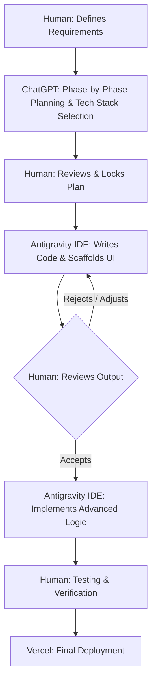

# AI-Native Workflow Note

## Tools Used & Division of Labor
- **ChatGPT:** Used extensively for phase-by-phase planning, architecting the solution, and making critical decisions regarding the tech stack and libraries (e.g., choosing Tiptap and Supabase).
- **Google Antigravity Agentic IDE:** Used as an AI co-pilot to actively write, refactor, and debug the actual codebase based on the plan.
- **Vercel:** Used for deployment.

## Where AI Materially Sped Up My Work
By cleanly dividing the labor between planning and execution, the AI fundamentally changed how I approached the 4-6 hour timebox.
- **Phase-by-Phase Planning (ChatGPT):** I used ChatGPT to break the complex requirements into manageable, sequential steps. It helped me evaluate library trade-offs and lock in a tech stack before I ever wrote a line of code.
- **Rapid Coding (Antigravity IDE):** Once the plan was set, Antigravity IDE handled the heavy lifting of boilerplate code. It rapidly generated the React UI components, implemented the file upload parsing logic, and seamlessly connected the Supabase realtime channels.
- **Debugging:** The AI sped up resolving strict TypeScript compilation errors during the deployment phase.

## What AI-Generated Output I Changed or Rejected
The AI is a powerful co-pilot, but requires human judgment:
- **UI & UX Decisions:** I frequently rejected AI-generated layouts when the spacing or aesthetics didn't feel premium, manually overriding it to fix alignments.
- **Architecture Choices:** The AI sometimes tried to overcomplicate backend routing logic. I intervened to ensure we used a simpler, more maintainable structure to avoid technical debt.

## How I Verified Correctness and Quality
I treated the AI like a junior engineer: trust, but verify. 
1. **Manual Testing:** Verified all access-control logic and real-time features by running two separate browser instances side-by-side with different user accounts.
2. **Monitoring:** Closely monitored the network tab to ensure the debounced auto-save function wasn't causing unnecessary database writes. 

## The Human-AI Loop (Diagram)

