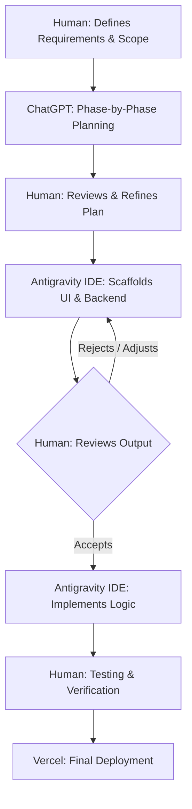

# AI-Native Workflow Note

## Tools Used
- Google Antigravity Agentic IDE (Antigravity) 
- Chatgpt ( for phase by phase planning)
- Vercel (for deployment )

## Where AI Materially Sped Up My Work
The AI fundamentally changed how I approached the 4-6 hour timebox by handling the heavy lifting of boilerplate code. 
- **Component Scaffolding:** Used AI to rapidly generate the React UI components and layout structures.
- **Data Logic:** Accelerated the implementation of the file upload feature by having the AI generate the `FileReader` and parsing logic.
- **Debugging:** Sped up resolving strict TypeScript compilation errors during the deployment phase.

## What AI-Generated Output I Changed or Rejected
The AI is a powerful co-pilot, but requires human judgment:
- **UI & UX Decisions:** I frequently rejected AI-generated layouts when the spacing or aesthetics didn't feel premium, manually overriding it to fix alignments.
- **Architecture Choices:** The AI sometimes tried to overcomplicate backend routing logic for the deployment. I intervened to ensure we used a simpler, more maintainable structure to avoid technical debt.

## How I Verified Correctness and Quality
I treated the AI like a junior engineer: trust, but verify. 
1. **Manual Testing:** Verified all access-control logic and real-time features by running two separate browser instances side-by-side with different user accounts.
2. **Monitoring:** Closely monitored the network tab to ensure the debounced auto-save function wasn't causing unnecessary database writes. 

## The Human-AI Loop (Diagram)

